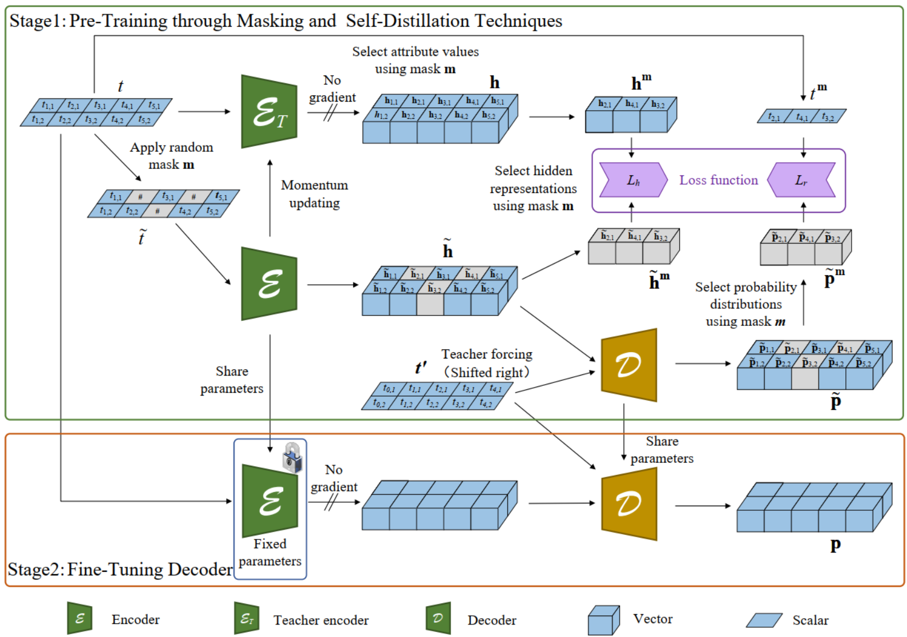

# SEED: A Transformers-Based Autoencoder Enhanced by Masking and Self-Distillation for Business Process Anomaly Detection
This is the source code of our paper '**SEED: A Transformers-Based Autoencoder Enhanced by Masking and Self-Distillation for Business Process Anomaly Detection**'.


## Absract
Detecting anomalies in business processes is integral to ensuring operational success. Unsupervised anomaly detection methods, due to their label-free nature, have gained traction. However, prevailing anomaly detection approaches relying on autoencoders confront the persistent challenge of overfitting. To address this, we propose a transformers-based autoencoder enhanced by masking and self-distillation for business process anomaly detection, named SEED. The transformers-based autoencoder is capable of capturing interrelationships across multiple perspectives. Incorporating masking and self-distillation techniques, our model not only reconstructs masked attribute values but also aligns hidden representations with those generated by a teacher encoder. These techniques enhance the model's generalization, fostering robustness against noise.
Moreover, we introduce a novel method for computing anomaly scores, effectively mitigating the impact of varying potential attribute values. 
We conduct extensive experiments on synthetic and real-life logs, showcasing SEED's superior performance over state-of-the-art methods by a substantial margin. Ablation studies indicate that employing masked autoencoding and self-distillation techniques significantly enhances the model's generalization, ultimately leading to improved anomaly detection performance.

## Datasets
Five commonly used real-life datasets:

i) _**BPIC12**_: The event log for a loan application process.

ii) _**BPIC13**_: This dataset relates to Volvo IT incident and problem management, covering three distinct logs.

iii) _**BPIC20**_: The dataset encompasses events related to two years of travel expense claims. Events were recorded in 2017 for two departments and extended to cover the entire university in 2018. This dataset encompasses five distinct logs.

iv) _**Receipt**_: This log records the execution of the receiving phase of the building permit application process in an anonymous municipality.

v) _**Sepsis**_: Events in this log correspond to sepsis cases observed in a hospital.

>All real-life logs utilized in the experiments are stored in the 'eventlogs' folder. Each log is named according to the following convention: 'log_Name-anomaly_Ratio'.

Eight synthetic datasets: i.e., **_Paper_**,  _**P2P**_, **_Small_**, **_Medium_**, **_Large_**, **_Huge_**, **_Gigantic_**, and **_Wide_**.

>All synthetic logs utilized in the experiments are stored in the 'eventlogs' folder. Each log is named according to the following convention: 'log_Name-anomaly_Ratio-attribute_Number'.

## Requirements
- [PyTorch](https://pytorch.org)
- [NumPy](https://numpy.org)
- [scikit-learn](https://scikit-learn.org)
- [pm4py](https://pm4py.fit.fraunhofer.de/)


## Run
    ```
      python main.py # get the result for SEED on each dataset
    ```
